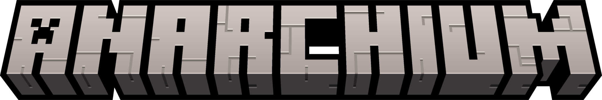

<h1>
    
     
</h1>

Anarchium is a Minecraft Mod that brings chaos to your world just like the infamous <a href="https://www.gta5-mods.com/scripts/chaos-mod-v">Chaos Mod V</a>.

No additional content is getting added to your world, allowing you to remove it without any problems, but still giving a
new chaotic experience to play Minecraft.

 <b>Note:</b> This mod is heavily work in progress and is still missing a LOT of features and effects.

### Effects

These are the available effects that can be randomly chosen:

* Anti-Portrait Mode
* Bigger Block Entities
* Black Screen
* Blindness
* Blurry Screen
* Broken World
* Burn Nearby Mobs
* Burn Players
* Damage Players
* Dirt
* Drop Inventory
* Drop Item
* Enchant Current Item
* Enchant Armor Piece
* Entity Magnet
* Everyone is a Villager
* Explode Mobs
* Explode Nearby Entities
* Explode Players
* Fake Teleport to Heaven
* Fatigue
* Fireworks!
* Flat World
* Fling Players
* Get Rotated
* Give Diamonds
* High Pitch
* Hopping
* Insane Gravity
* Invert Velocity
* Invisibility
* Jail
* Large Entities
* Low Pitch
* My sneak key is broken
* Negative Field of View
* No Gravity
* No Jumping
* No Sneaking
* Place Lava
* Place Nearby Mobs into a Boat
* Portrait Mode
* Quake Field of View
* Replace Every Sound with Villagers
* Reversed Gravity
* Rolling Camera
* Rotating Camera
* Skeletons Have Spinbot
* Spawn Boat
* Spawn Creepers
* Spawn Minecart
* Spawn Wandering Trader
* Spinning Mobs
* Suicide
* Teleport Nearby Mobs to Players
* Teleport to Heaven
* Teleport to Void
* Upside Down Mobs
* W I D E M O B S
* Where are my chunks?
* Where is the sky?
* ZEUSSSS

**...and more to come!**

### Compatibility

This mod is currently only compatible with [NeoForge](https://neoforged.net) on 1.21.1, but will be compatible with
other mod loaders in the future.

**Note:** There will be no backports for older versions, as it's time-consuming and not worth the effort. Plus
writing [Mixins](https://github.com/SpongePowered/Mixin) for older versions is a lot of work.

### Downloads

**As this mod is still in development**, there are currently no downloads available. You'll need to build the mod
yourself using Gradle.

However, the mod will be available on both [CurseForge](https://www.curseforge.com)
and [Modrinth](https://modrinth.com) in the future.

### Building

Anarchium uses the Gradle build tool and can be built with the `gradle build` command. The build artifacts can be found
in the `build/libs` directory.

The Gradle wrapper is provided for ease of use and will automatically download and install the appropriate version of
Gradle for the project build. To use the Gradle wrapper, substitute gradle in build commands with `./gradlew.bat` (
Windows) or `./gradlew` (macOS and Linux).

### License

The content of this repository is provided under the [MIT](LICENSE.md) license by [ZickZenni](https://zickzenni.com).